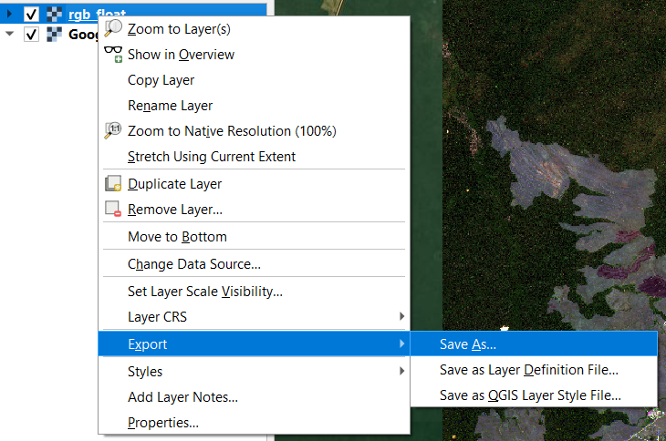
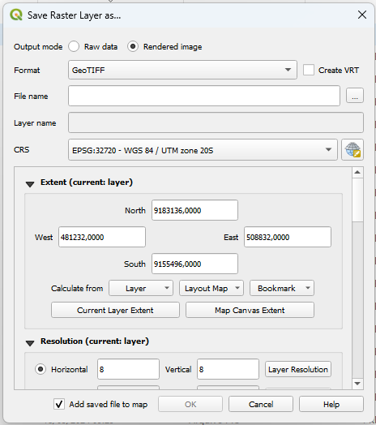
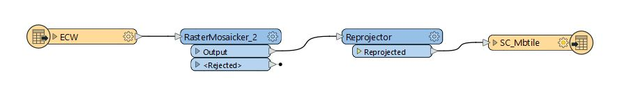

## Gerar MBTile

Para realizar o carregamento na plataforma, deverá ser gerado um MBTile, que é um formato de armazenagem de *tilesets*, estes sendo imagens reunidas em um grid uniforme de níveis de zoom pré-definidos. 

Tais *tilesets* podem ser no formato raster (TIFF ou GeoTIFF) ou no formato vetorial (GeoJSON, Shapefile, KML, GPX).

A depender do nível de zoom ou da região a ser exibida, é realizada uma consulta ao MBTile requisitando a imagem a ser mostrada para o usuário.

Para que o arquivo gerado seja visualizado, é necessário que este esteja no EPSG 3857 (WGS-84 Pseudo-Mercator). Além disso, devido a limitações do QGIS, a ferramenta Zoom to Layer não é funcional quando aplicada a camada de *tilesets*.


## Disponibilização do MBTile

1. Geração do Mosaico (utilizando como entrada os arquivos .geoTIFF), e conversão para .ecw já na hora de exportar via FME.
2. Processamento no FME, realizando a conversão do arquivo .ecw para o formato .mbtile.
3. Upload do arquivo para dentro do container do docker no servidor da DGEO e inserção dos metadados no arquivo config.json do TileServer.
<!--4. Atualizar o Docker com as novas imagens para disponibilização. (Utilização do comando ```docker restart```)-->

## Procedimento no QGIS para imagem CBERs-4A

1. No Qgis faça a composição RGBI das bandas  Red, Green, Blue e Infra.
2. Use a banda Pan e faça Pansharp para obter uma imagem com 2m de resolução.
3. Export o Geotiff como renderizado.

| |
|:--:|
| *Tela do QGIS* |

<div align="center">
  
  |:--:|
  | *Tela do QGIS* |
</div>

## Procedimento no FME

1. Carregar os .geotiff renderizados
2. Realizar a mosaicagem dos arquivos pelo **RasterMosaicker**
3. Realizar a reprojeção do mosaico para o EPSG 3857 pelo **Reprojector**
4. Usar **resample** de 0.5 no FME para ampliar o zoom da imagem CBERS.
5. Realizar a geração do MBTile pelo Writer **MapBox MBTiles**

| |
|:--:|
| *Tela do FME* |