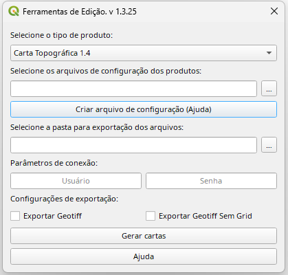

# Edição e exportação

Para a edição de Cartas Ortoimagem, deve ser utilizado o plugin Ferramentas de Edição, que tem como finalidade auxiliar a edição por intermédio de processings e o uso de botões de edição. Além disso, o Ferramentas de Edição é responsável por exportar o produto Carta Ortoimagem em PDF/Geotiff, utilizando o JSON de configuração.

Para a exportação é necessário que o produto já esteja editado, ou seja, já realizado o posicionamento dos rótulos e símbolos e já realizado o processo de generalização cartográfica de modo a otimizar a legibilidade. Os atributos adicionais da EDGV 3.0 Orto permitem que seja realizada uma edição manual ou automática da Carta Ortoimagem. O plugin [Ferramentas de Edição](https://github.com/dsgoficial/ferramentas_edicao) para a exportação deve ser utilização em um projeto em branco.

Após a edição é necessário configurar o json conforme o exemplo a seguir:

```jsx title="Json de exportação para Carta Ortoimagem"
{
    "inom": "SA-20-Z-D-III-2-NE",
    "nome": "MANAUS",
    "territorio_internacional": false,
    "acesso_restrito": false,
    "licenciamento_produto": "CC-BY-SA 4.0",
    "tipo_produto": "Carta Ortoimagem",
    "escala": 25000,
    "edicao_produto": "1-DSG",
    "versao_produto": "2.5",

    "imagens": [
        {
            "caminho_imagem": "D:\\PIT_2025\\Manaus\\Manaus.ecw",
            "epsg": "4326"
        }
    ],
    "mde_diagrama_elevacao": {
        "caminho_mde": "D:\\PIT_2025\\Manaus\\MDT_Manaus.tif",
        "epsg": "4674"
    },
    "banco": {
        "servidor": "10.79.8.62",
        "porta": "5432",
        "nome": "orto_0578_2_ne_edicao"
    },
    "classes_complementares": [
        "llp_unidade_federacao_a",
        "elemnat_curva_nivel_l",
        "elemnat_ponto_cotado_p",
        "infra_pista_pouso_p",
        "infra_pista_pouso_l",
        "infra_pista_pouso_a",
        "elemnat_toponimo_fisiografico_natural_p",
        "elemnat_toponimo_fisiografico_natural_l",
        "elemnat_ilha_p",
        "elemnat_ilha_a",
        "llp_aglomerado_rural_p",
        "llp_area_pub_militar_a",
        "llp_terra_indigena_a",
        "llp_unidade_conservacao_a",
        "infra_elemento_energia_p",
        "infra_elemento_energia_l",
        "infra_elemento_energia_a",
        "constr_extracao_mineral",
        "elemnat_terreno_sujeito_inundacao"
    ],

    "fases": [
        {
            "nome": "Imageamento",
            "executantes": [
                {
                    "nome": "DigitalGlobe, Inc.",
                    "ano": "09/2023"
                }
            ]
        },
        {
            "nome": "Processamento Digital de Imagens",
            "executantes": [
                {
                    "nome": "Diretoria de Serviço Geográfico - 4º CGEO",
                    "ano": "03/2025"
                }
            ]
        },
        {
            "nome": "Extração",
            "executantes": [
                {
                    "nome": "Diretoria de Serviço Geográfico - 4º CGEO",
                    "ano": "07/2025"
                }
            ]
        },
        {
            "nome": "Validação",
            "executantes": [
                {
                    "nome": "Diretoria de Serviço Geográfico - 4º CGEO",
                    "ano": "08/2025"
                }
            ]
        },
        {
            "nome": "Edição",
            "executantes": [
                {
                    "nome": "Diretoria de Serviço Geográfico - 4º CGEO",
                    "ano": "08/2025"
                }
            ]
        }
    ],
    "sensores": [
        {
            "tipo": "Multiespectral",
            "plataforma": "Orbital",
            "nome": "WorldView-2",
            "resolucao": "0,50 m",
            "bandas": "5-3-2",
            "nivel_produto": "Standard"
        }
    ],
    "info_tecnica": {
        "pec_planimetrico": "A",
        "pec_altimetrico": "A",
        "data_criacao": "06/09/2023",
        "datum_vertical": "Imbituba - Santa Catarina",
        "origem_dados_altimetricos": "FABDEM (Forest And Buildings removed Copernicus DEM)",
        "dados_terceiros":[
            "Modelo geoidal: hgeoHNOR2020 - IBGE",
            "Terras indígenas: FUNAI*",
            "Unidades de conservação: ICMBio*",
            "Imagens: Rede MAIS - PF/MJSP**"
        ],
        "observacoes": [
            "* Limites sujeitos à homologação do referido órgão.",
            "** Fonte: Rede MAIS/MJSP, inclui material © Planet Labs IOnc. Todos os direitos reservados."
        ]
        
    },
    
}

```
## Ferramenta de Edição

### Plugin

É a ferramenta que realiza a exportação do produto para .pdf ou .geotiff, as entradas são:



- Tipo de Produto: Carta Ortoimagem 2.5
- Arquivos de Configuração: JSON de configuração, podem ser selecionados múltiplos
- Criar arquivo de configuração (Ajuda): cria um arquivo JSON com a ajuda do plugin
- Pasta para exportação: onde seram salvos os arquivos gerados
- Parâmetros de conexão: dados para acesso ao BD Edição
- Exportar Geotiff: para exportar ou não o Geotiff, com e sem grid interno

### Processing

Existem duas ferramentas de processamento que auxiliam a edição semiautomática da Carta Ortoimagem, que podem ser acessados pela aba de Processing -> Ferramentas de Edição -> Preparo de Edição

- Configurar Estilo de Edição: carrega os .qml de acordo com a escala, e ainda definir a equidistância se ela for fora do padrão.
- Gerar Vetor de Grade: gera a grade de acordo com a camada aux_moldura_a e a escala do produto.

### Padronização de Nomes dos Produtos

- O produto normalmente será nomeado em referência a feição natural ou cultural de maior relevância contida na região do produto.
- O nome do produto deve ser único sempre que possível.
- Nome de feições culturais têm maior preferência em relação a feições naturais, porém, se uma feição natural é mais conhecida que qualquer feição cultural contida no produto o nome da feição natural deve ser a escolhida. Nomes de rios, serras e outras feições que se estendem por diversos produtos devem ser evitados.
- Quando a feição de maior relevância é dividida na região de mais de um produto, deve ser escolhido um dos produtos para receber o nome da feição e produtos adjacentes que contenham porções da feição podem ser utilizados os sufixos “-N”, “-S”, “-E”, “-O”, “-NE”, “-NO”, “-SE”, “-SO”.
- Quando nenhum nome puder ser determinado deve ser utilizado o MI, por exemplo “MI-2906-1-NE”.
- Nome dos produtos em diferentes escalas devem ser coerentes sempre que possível. Um dos nomes da 1:100.000 deve ser o nome da 1:250.000 correspondente, e analogamente para as outras escalas.