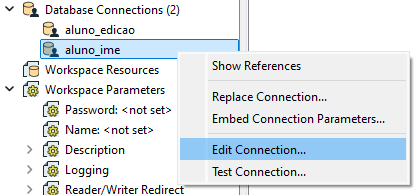
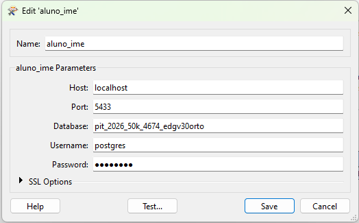
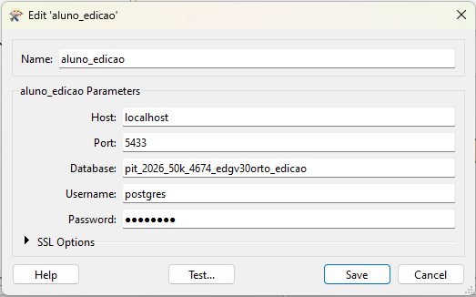
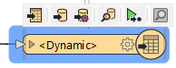
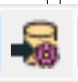

# Reprojetar banco aquisição para banco edição
Para realizar a etapa de Edição é necessário reprojetar o banco de aquisição para UTM.

## Reprojeção

Abra o **FME** e selecione os bancos de aquisição e edição conforme o workflow a seguir:

Na lateral direita, acesse em **Navigator** os parâmetros de conexão dos bancos:

Selecione o banco de aquisição e pressione o botão direito do mouse para editar a conexão:

Será aberta uma aba com os parâmetros de conexão: `HOST`, `Port`, `Database`, `Username`, `Password`.

No exemplo abaixo o `Host` inserido foi localhost pois o banco utilizado estava hospedado localmente e não no servidor. 

No caso em que for usado o servidor, deve-se usar o `Host:10.x.x.x` e `Port:5432`:

Após isso, selecione o banco de edição e pressione o botão direito do mouse para editar a conexão:

Proceda de forma análoga ao banco de aquisição e configure os parâmetros do banco de edição:

Antes de realizar o worflow, garanta que o EPSG do banco de edição esteja configurado corretamente:

 

Será aberta o aba a seguir:

Finalizado isso, basta rodar o workflow para reprojetar o banco de dados.
