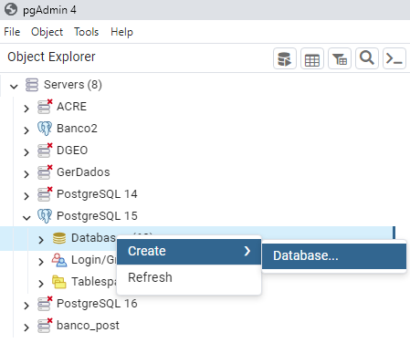
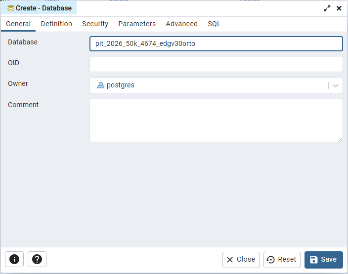

# Criar banco de dados Postgis
 
A criação do banco postgis deve ser feita a partir da modelagem disponível no Github da DSG:

[modelagem carta orto](https://github.com/dsgoficial/modelagens/tree/master/edgv_300_orto/2_5)

[modelagem carta topo](https://github.com/dsgoficial/modelagens/tree/master/edgv_300_topo/1_4)

Após baixar os arquivos `edgv_300_orto_25.sql`, `edgv_300_orto_extension_25` crie um banco vazio no PgAdmin com o nome padrão:

```
Aquisição: pit_ano_escala_EPSG_edgv30tipo
Edição: pit_ano_escala_EPSG_edgv30tipo_edicao

Exemplos: 

pit_2026_50k_4674_edgv30orto
pit_2026_50k_4674_edgv30orto_edicao

```
Após criar o banco de Aquisição, abra uma `Query tool` e preencha com as informações do arquivo `edgv_300_orto_25.sql`, execute, e logo depois, uma nova `query tool` 
e preencha com o arquivo `edgv_300_orto_extension_25`:





Feito isso, abra uma `query tool` pressionando o botão direito do mouse no banco criado:


É possível arrastar o arquivo .sql para o PgAdmin:


Daí, execute pressionando a tecla `F5`, em seguida, carregue outra query com o outro arquivo .sql e execute novamente.

